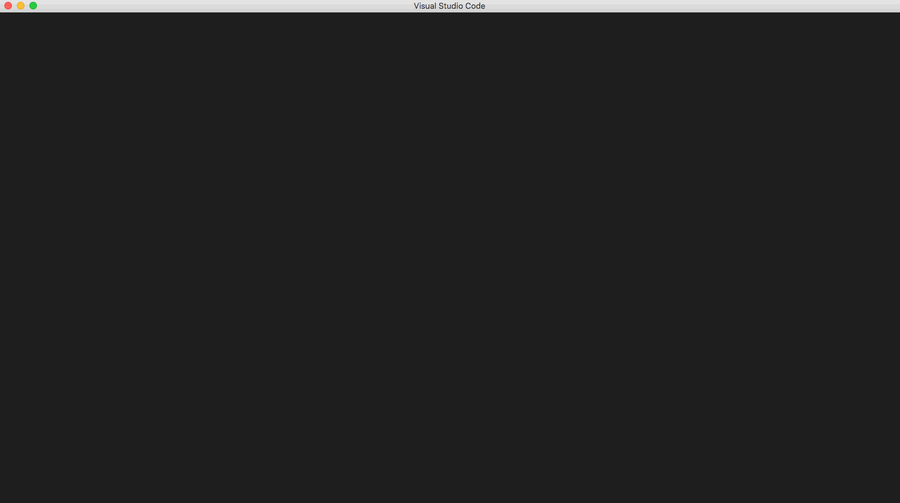

# IBM Q Studio

> IBM Q Studio is a tool that makes simple working with Open QASM files and Qiskit SDK.

[](https://travis.ibm.com/IBMQuantum/qiskit-studio)

A Visual Studio Code extension with support for Qiskit and the Open QASM language. It provides some useful commands to make easier launching jobs and visualizing results among others.



## Quick start

1. Open the Extensions sidebar panel in VS Code. `Ctrl + Shift + X` on Windows or `⇧ + ⌘ + X` on Mac.
2. Search for Q Studio.
3. Click Install.
4. Click Reload.

Now the Q Studio extension will be available in Open QASM and Python(Qiskit) files.

### To install the extension from a local file

Download the [latest release](https://github.ibm.com/IBMQuantum/qiskit-studio/releases) of the extension from and follow the [instructions to install it](https://code.visualstudio.com/docs/editor/extension-gallery#_install-from-a-vsix)

### Your first program using Qiskit
We encourage you to visit [https://qiskit.org/](https://qiskit.org/) to explore the different examples, documentation and tutorials.

## Feature details

* Check necessary dependencies to execute Open QASM or Qiskit files.
* Run Qiskit source code in a backend.
* Run Open QASM source code in a local backend.
* Backends (local and remote ones) discovery.
* Job's execution management.
* User's credit management.
* Open QASM error detection.
* Open QASM autocompletion.
* Qiskit static analysis.

## Useful commands

The commands below are supported at the Command Palette (Command+Shift+P on macOS and Ctrl+Shift+P on Windows/Linux).

Command | Description
--- | ---
```QStudio: Check IBM Q Studio dependencies``` | Check that the required dependencies are properly installed.
```QStudio: Enter your QConfig``` | Allow the user to configure her Qiskit credentials. Please, note that you will need to run this command prior to use `Get the status of IBM Q devices`, `QStudio: Discover remote backends available`, `QStudio: List the user's pending jobs`, `QStudio: List the user's executed jobs`, `QStudio: Get the queue status` and `QStudio: Get the user's available credits` or they will fail.
```QStudio: Run this Q code``` | Executes the code at the current editor tab (Qiskit or Open QASM).
```QStudio: Discover local backends available``` | The local backend available will be presented in a new tab.
```QStudio: Get the status of IBM Q devices``` | The status for remote IBM Q devices available for the current user will be presented in a new tab. This information mixes also data from `Discover remote backends available` and `QStudio: Get the queue status`.
```QStudio: Discover remote backends available``` | The remote backends available for the current user will be presented in a new tab.
```QStudio: List the user's pending jobs``` | A listing of the pending jobs to be executed will be presented in a new tab.
```QStudio: List the user's executed jobs``` | A listing of the previously executed jobs will be presented in a new tab.
```QStudio: Get the queue status``` | The current status of the queues will be presented in a new tab.
```QStudio: Get the user's available credits``` | The current available credits of the user will be presented in a new tab.
```QStudio: Activate the visualizations for the execution of code``` | Activate the automatic visualization of results achieved during the execution of code using the extension.
```QStudio: Deactivate the visualizations for the execution of code``` | Deactivate the automatic visualization of results achieved during the execution of code using the extension (giving the results in text mode).
```QStudio: Activate the display of information related to the boot of the extension``` | Activate the visualization (bubble messages) of information related to the boot of the extension. This information includes the version of dependencies installed, the different checks performed at the activation of the extension, etc.
```QStudio: Deactivate the display of information related to the boot of the extension``` | Deactivate the visualization (bubble messages) of information related to the boot of the extension. It does not deactivate the display of error messages related to dependencies and other checks performed at the boot of the extension

## Settings Options

This extension contributes the following variables to the settings:

  * `ibm-q-studio.qiskit.token`: Qiskit & Q Experience API Token.
  * `ibm-q-studio.qiskit.hub`: User's Qiskit & Q Experience hub.
  * `ibm-q-studio.qiskit.group`: User's Qiskit & Q Experience group.
  * `ibm-q-studio.qiskit.project`: User's Qiskit & Q Experience project.
  * `ibm-q-studio.config.visualizationsFlag`: Flag to control if visualizations are displayed or not for code executions.
  * `ibm-q-studio.config.displayBootInfo`: Display info about the extension boot process.

Other variables are contributed, but it is not recommended to change them.

## Authors (alphabetical)

IBM Q Studio was originally authored by Juan Cruz-Benito, Yeray Darias, Ismael Faro, Juan Gómez and Paco Martín.

And continues to grow with the help and work of [many people](https://github.ibm.com/IBMQuantum/qiskit-studio/graphs/contributors) who contribute to the project at different levels.

## License
This project uses the [Apache License Version 2.0 software license](https://www.apache.org/licenses/LICENSE-2.0).
